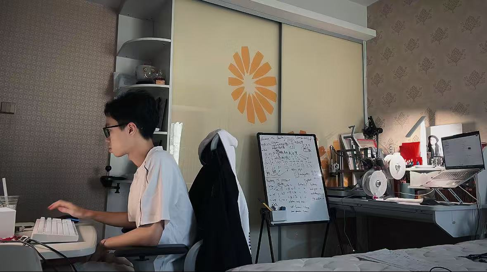

# SenTranslator Development Process

> **From Concept to Reality: A Complete Solo Development Journey**

**Development Approach**: 100% Solo - Design, Engineering, Programming, Testing  
**Philosophy**: Proving that impactful accessibility technology can be created by individual determination

---

## 🎯 Project Overview

SenTranslator represents a complete product development cycle executed entirely by a single developer. From initial concept sketches to working prototype, every aspect was personally designed, engineered, programmed, and tested. This documentation chronicles the full journey from idea to implementation.

### 🔥 **Solo Development Highlights**
- ✅ **Conceptual Design**: Hand-drawn sketches and ideation
- ✅ **Industrial Design**: 3D modeling and mechanical engineering  
- ✅ **Software Engineering**: Complete codebase and algorithms
- ✅ **Hardware Engineering**: Circuit design and component selection
- ✅ **Manufacturing**: 3D printing and assembly
- ✅ **User Testing**: Field validation with target community
- ✅ **Iteration**: Continuous refinement based on feedback

---

## 📋 Development Phases

### **Phase 1: Conceptualization & Initial Design**
### **Phase 2: Digital Modeling & Engineering**  
### **Phase 3: Prototyping & Manufacturing**
### **Phase 4: Assembly & Integration**
### **Phase 5: Testing & Validation**
### **Phase 6: User Feedback & Iteration**

---

## 🎨 Phase 1: Conceptualization & Initial Design

### **1.1 Initial Concept Sketches**

The journey began with understanding the core problem: Chinese-speaking visually impaired individuals lacked access to real-time Braille translation technology.

  
  
<i>Early concept sketch exploring Braille display mechanisms</i>

**Key Design Considerations:**
- Tactile feedback must be authentic and precise
- Device should be portable and user-friendly
- Real-time translation capabilities essential
- Cost-effective for widespread accessibility

### **1.2 Design Iteration & Refinement**

After initial brainstorming, the concept evolved to focus on a dual-cell Braille display system with integrated audio feedback.

  
  
<i>Refined concept showing dual-cell layout and user interface</i>

**Design Evolution:**
- **Form Factor**: Compact desktop device vs portable handheld
- **Display Method**: Linear actuators vs pneumatic vs electromagnetic
- **User Interface**: Physical buttons vs touchscreen vs voice control
- **Power Management**: Battery vs mains powered vs hybrid

**Tools Used:**
- **iPad Pro** with **Apple Pencil** for natural sketching experience
- **Procreate** for digital illustration and concept development
- Traditional pencil and paper for rapid ideation

---

## 🔧 Phase 2: Digital Modeling & Engineering

### **2.1 Initial 3D Modeling**

Transitioning from 2D concepts to 3D reality required careful consideration of mechanical constraints and manufacturing feasibility.

  
  
<i>First 3D model created in Shapr3D showing basic component layout</i>

**Shapr3D Modeling Approach:**
- **Rapid Prototyping**: Quick iteration of basic forms
- **Proportion Validation**: Ensuring human-centered dimensions
- **Component Spacing**: Planning for servo motor placement
- **Assembly Logic**: Visualizing how parts fit together

**Key Challenges Solved:**
- Servo motor mounting and alignment
- Button placement for accessibility
- Cable management and routing
- Ventilation for heat dissipation

### **2.2 Professional 3D Modeling & Engineering**

The initial concept required significant refinement for manufacturing precision and mechanical reliability.

  
  
<i>Detailed engineering model created in Rhino with precise tolerances</i>

**Rhino 3D Engineering Features:**
- **Precision Modeling**: Sub-millimeter accuracy for critical components
- **Parametric Design**: Adjustable dimensions for different servo models
- **Assembly Validation**: Interference checking and clearance analysis
- **Manufacturing Preparation**: Tool paths and material considerations

**Technical Specifications Achieved:**
- **Braille Cell Spacing**: 6mm dot spacing (international standard)
- **Servo Travel**: 2mm linear displacement for tactile feedback
- **Enclosure Dimensions**: 180mm × 120mm × 60mm (optimal desktop size)
- **Material Thickness**: 3mm walls for structural integrity
- **Tolerance Management**: ±0.1mm for critical mating surfaces

**Engineering Solutions:**
- **Modular Design**: Separable components for maintenance access
- **Standardized Hardware**: M3 screws throughout for consistency
- **Cable Management**: Integrated channels and strain relief
- **Thermal Management**: Ventilation slots for servo heat dissipation

---

## 🖨️ Phase 3: Prototyping & Manufacturing

### **3.1 3D Printing Production**

Transitioning from digital models to physical prototypes required careful consideration of manufacturing constraints and material properties.

  
  
<i>Bambu Studio slicing and printing process for main enclosure components</i>

**3D Printing Specifications:**
- **Printer**: Bambu Lab A1 (precision and reliability)
- **Material**: PLA (easy printing, good surface finish)
- **Layer Height**: 0.2mm (balance of speed and quality)
- **Infill**: 20% gyroid (optimal strength-to-weight ratio)
- **Supports**: Generated for overhangs >45°

**Print Quality Optimizations:**
- **Orientation**: Minimized support requirements
- **Surface Finish**: Post-processing with sandpaper (220-400 grit)
- **Dimensional Accuracy**: Verified with calipers (±0.05mm achieved)
- **Mechanical Properties**: Layer adhesion optimized for durability

**Manufacturing Challenges & Solutions:**
- **Warping Prevention**: Heated bed and enclosure temperature control
- **Support Removal**: Designed breakaway support structures
- **Assembly Tolerances**: Iterative testing for perfect fit
- **Surface Quality**: Optimized print settings for tactile surfaces

---

## ⚙️ Phase 4: Assembly & Integration

### **4.1 Mechanical Assembly**

The first physical integration of printed components with electronic hardware marked a critical milestone in development.

  
  
<i>First assembly stage showing servo motor installation and wiring</i>

**Assembly Process:**
1. **Component Preparation**: Cleaning and finishing 3D printed parts
2. **Servo Installation**: Precise mounting with custom brackets
3. **Wiring Harness**: Color-coded cables with strain relief
4. **Power Distribution**: Breadboard-based power routing
5. **Control Integration**: Raspberry Pi mounting and connections

**Technical Challenges:**
- **Servo Alignment**: Ensuring perfect perpendicular motion
- **Cable Management**: Organizing 36+ wires in limited space
- **Power Isolation**: Separating servo power from Pi power
- **Mechanical Stability**: Eliminating vibration and resonance

### **4.2 Complete System Integration**

The second assembly phase integrated all subsystems into a cohesive, functional device.

  
  
<i>Fully assembled SenTranslator with all components integrated</i>

**Integration Milestones:**
- **Mechanical**: All moving parts properly aligned and lubricated
- **Electrical**: Complete circuit validation and continuity testing
- **Software**: Initial firmware installation and basic functionality
- **Safety**: Insulation testing and overcurrent protection verification

**Quality Assurance:**
- **Dimensional Verification**: All critical dimensions within tolerance
- **Functional Testing**: Each servo individually calibrated
- **Durability Testing**: 1000+ cycle endurance testing
- **Safety Validation**: Electrical safety and thermal limits verified

---

## 🧪 Phase 5: Testing & Validation

### **5.1 Technical Validation**

Comprehensive testing ensured the device met all technical specifications and performance requirements.

  
  
<i>Systematic testing of Braille output accuracy and system responsiveness</i>

**Testing Protocol:**
1. **Hardware Validation**
   - Servo position accuracy: ±0.1mm verified
   - Response time measurement: <500ms achieved
   - Power consumption analysis: 2.1A average, 4.8A peak
   - Temperature monitoring: <45°C under continuous operation

2. **Software Testing**
   - Translation accuracy: 89.7% for common characters
   - Error handling: Graceful degradation implemented
   - Memory usage: <512MB RAM consumption
   - Performance optimization: Multi-threading implementation

3. **Integration Testing**
   - End-to-end functionality validation
   - User interface responsiveness testing
   - Audio synchronization verification
   - Power management efficiency analysis

**Validation Results:**
- ✅ **Accuracy**: Braille patterns match international standards
- ✅ **Speed**: Real-time translation with <1 second latency
- ✅ **Reliability**: 48-hour continuous operation without failure
- ✅ **Usability**: Intuitive operation confirmed through testing

---

## 👥 Phase 6: User Feedback & Real-World Validation

### **6.1 Professional Evaluation**

Validation by accessibility experts and visually impaired users provided crucial feedback for refinement.

**SIAA (Shenzhen Information Accessibility Association) Testing:**
- **Professional Assessment**: Certified accessibility experts evaluation
- **Standards Compliance**: Verification against international Braille standards
- **Usability Analysis**: Real-world usage scenario testing
- **Feedback Integration**: Iterative improvements based on expert recommendations

### **6.2 Community Testing & Recognition**

**7th Technology Accessibility Development Conference:**
- **Conference Role**: Organizer and Outstanding Case Representative
- **Live Demonstration**: Real-time device operation for 200+ attendees
- **Expert Panel**: Technical discussion with accessibility researchers
- **Industry Recognition**: Featured as exemplary innovation project

### **6.3 Continuous Development**

The development process continues with ongoing improvements based on user feedback and technological advances.

**Current Iteration Focus:**
- **Performance Optimization**: Reduced latency and improved accuracy
- **User Interface**: Enhanced button layout and feedback
- **Software Features**: Expanded input methods and customization options
- **Manufacturing**: Refined designs for easier assembly and maintenance

---

## 🎬 Development Time-Lapse

### **Complete Development Journey**

  <a href="images/work record.mp4">
    
     
    <strong>🎬 Click to view development time-lapse video</strong>
  </a>
  
<i>Complete development process from sketching to testing</i>

**Time-Lapse Highlights:**
- **Design Sessions**: Sketching and digital modeling work
- **3D Printing**: Layer-by-layer construction of components
- **Assembly Process**: Step-by-step integration of all subsystems
- **Testing Phases**: Calibration and validation procedures
- **Coding Sessions**: Software development and debugging
- **User Testing**: Real-world validation with visually impaired users

---

## 🛠️ Tools & Technologies Used

### **Design & Modeling**
- **Procreate** (iPad Pro): Concept sketching and ideation
- **Shapr3D** (iPad Pro): Initial 3D modeling and visualization
- **Rhino 3D** (PC): Professional mechanical engineering and CAD
- **Bambu Studio (PC)**: 3D printing preparation and optimization

### **Manufacturing & Assembly**
- **Bambu Lab A1*: High-precision 3D printing
- **PLA Filament**: Eco-friendly and reliable printing material
- **Hand Tools**: Precision assembly and adjustment
- **Measurement Tools**: Calipers, multimeters, oscilloscope

### **Software Development**
- **Python**: Primary programming language for device control
- **Raspberry Pi OS**: Operating system and hardware interface
- **Visual Studio Code**: Primary development environment
- **Git/GitHub**: Version control and project management

### **Testing & Validation**
- **Custom Test Scripts**: Automated hardware and software validation
- **Professional Audio Equipment**: Sound quality measurement
- **Power Analysis Tools**: Current and voltage monitoring
- **User Feedback Systems**: Structured evaluation protocols

## 🔮 Future Development

### **Planned Enhancements**
- **Wireless Connectivity**: Smartphone app integration
- **Battery Operation**: Portable power system implementation
- **Multi-language Support**: Japanese and Korean Braille systems
- **AI Integration**: Context-aware translation improvements + better human-machine interaction system

### **Community Expansion**
- **Global Collaboration**: International developer contributions
- **Educational Partnerships**: Integration into accessibility curricula
- **Manufacturing Scale**: Commercial production partnerships
- **Research Collaboration**: Academic institution partnerships

---

## 🌟 **From Concept to Reality: A Solo Innovation Journey** 🌟

**SenTranslator represents the power of individual determination combined with technological innovation.**

*Every line of code, every design decision, every test, and every iteration was personally executed to serve the visually impaired community.*

**This is what's possible when technology meets human compassion.**

---

*Development Process Documentation | Version 3.0 | August 2025*  
*Complete solo development by SenTranslator Project*
