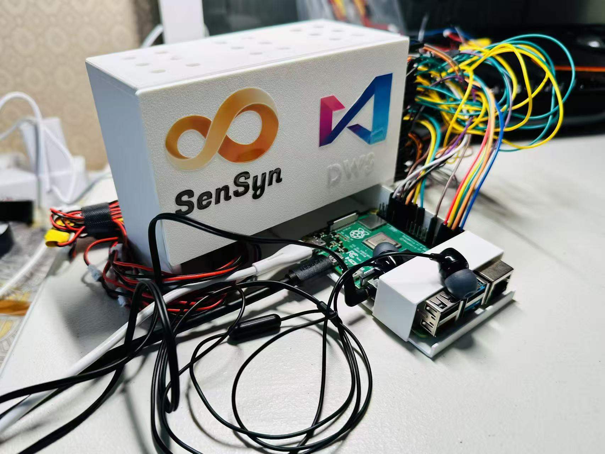
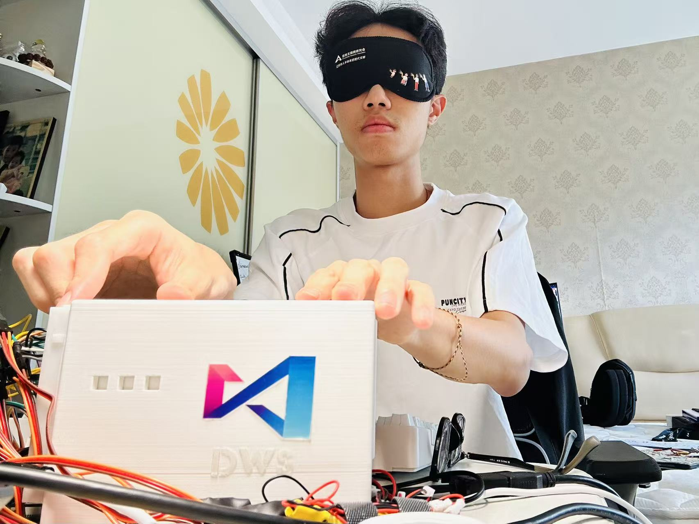

# SenTranslator 🦯

> **World's First Chinese-to-Braille Physical Converter**  
> *Technology Conveys Human Warmth*


<div align="center">
  
  <p><i>SenTranslator - Making Digital Content Accessible for Chinese visually impaired community</i></p>
</div>

## 📖 Project Background

China is home to **20% of the world's visually impaired population**, yet throughout history, there has never been a dedicated daily reading device that allows them to access real-time information. **SenTranslator** was born to address this critical gap.

Moving beyond basic safety and navigation needs, SenTranslator aims to enhance life happiness and satisfaction for the visually impaired community. Our mission is to enable equal access to technology and help individuals progress toward higher dimensions of human needs, following Maslow's hierarchy.

**SenTranslator is more than just a device** - it represents the unlimited possibilities of technology for good. We're building a barrier-free solution that breaks information boundaries, using technology to illuminate the information world for the visually impaired, ensuring everyone can equally access knowledge and perceive the world.

---

## ✨ Core Features

🔤 **Real-time Chinese-to-Braille Translation**: Instant conversion of Chinese, English, and numbers to tactile Braille  
🎬 **Audio-described Experience**: Enhanced multimedia content with voice feedback and enjoy audio-described movies anytime, anywhere
📱 **Multi-input Support**: OCR image recognition, web content extraction, and direct text input  
🖐️ **Physical Tactile Display**: Continuous Braille character display using precision electronic push rod arrays  
🧠 **Proprietary Algorithm**: Self-developed Chinese Braille mapping system verified by accessibility institutions.
🎵 **Text-to-Speech Integration**: Dual-mode accessibility with both tactile and audio output  

---

## 🛠️ Hardware Requirements

### 📋 **Bill of Materials**

| Component | Specification | Quantity | Purpose |
|-----------|--------------|----------|---------|
| 🥧 **Raspberry Pi** | 4B (4GB RAM recommended) | 1 | Main controller |
| ⚡ **Linear Servos** | KTD0905-10H (or equivalent) | 12 | Braille dot actuators |
| 🔌 **External Power Supply** | 5V/3A+ DC adapter | 1 | Servo power (⚠️ **Critical**) |
| 🍞 **Breadboards** | Standard half-size | 2 | Power distribution |
| 🔘 **Push Buttons** | Tactile switches | 3 | User interface controls |
| 🔗 **Jumper Wires** | Male-to-male dupont | 1 set | GPIO connections |
| 🎧 **Audio Output** | Speakers or wired headphones | 1 | Voice feedback |
| 💾 **MicroSD Card** | 32GB+ Class 10 | 1 | Operating system |
| 🔧 **Insulation Tape** | Electrical tape | 1 roll | Wire management |

### 🖨️ **3D Printing Materials**
- **Filament**: PLA (recommended for ease of printing)
- **Total Print Time**: ~8-12 hours
- **Components**: Main frame, removable cover, Pi mount, button panel, Braille buttons


## 🔍 Hardware Details

<div align="center">
  
  
  <p><i>Left: Internal hardware components | Right: Tactile Braille button interface</i></p>
</div>

---

## 🚀 Quick Start Guide

### Step 1: Hardware Assembly

#### ⚡ **Power Distribution Setup**
```
⚠️  CRITICAL SAFETY WARNING:
Use separate 5V power supply for servos!
Connecting servos directly to Pi's 5V rail WILL damage the board!

External 5V Power ──────────────> Breadboard + Rail
External GND Power ─────────────> Breadboard - Rail  
Raspberry Pi GND ──────────────> Breadboard - Rail
```

#### 🔌 **Servo Connections**
Each of the 12 linear servos connects as follows:
```
For each servo:
  Red Wire (VCC)    ──────────> Breadboard + Rail
  Black/Brown (GND) ──────────> Breadboard - Rail
  Orange/Yellow (PWM) ───────> Individual GPIO Pin
```

#### 📍 **GPIO Pin Assignments**
```python
# First Braille Cell (Left) - GPIO Pins:
Servo 1-6: [17, 22, 24, 12, 6, 25]

# Second Braille Cell (Right) - GPIO Pins:  
Servo 7-12: [16, 19, 26, 13, 20, 21]

# Control Buttons:
Button 1 (Next): GPIO 4
Button 2 (Audio): GPIO 27  
Button 3 (TTS): GPIO 5
```

#### 🎧 **Audio Output**
Connect speakers or headphones to Raspberry Pi's 3.5mm audio jack or USB audio device.

### Step 2: 3D Printing

#### 📁 **Print the Components**
All STL files are located in: [`3D printing models`](3D%20printing%20models/) folder

**Required parts:**
- `main frame.stl` - Primary housing structure (~4 hours)
- `removable cover.stl` - Access panel (~2 hours)  
- `Pi mount.stl` - Raspberry Pi bracket (~1 hour)
- `braille buttons cover.stl` - Button panel with 3 holes (~1 hour)
- `braille buttons.stl` - Tactile buttons 1-3 (~2 hours)
- `braille dots.stl` - Enlarged Braille dots (~2 hours)

**Print Settings:**
- Material: PLA
- Layer Height: 0.2mm  
- Infill: 15-20%
- Supports: Required for main frame overhangs

### Step 3: Software Installation

#### 🐍 **Install Dependencies**
```bash
# Update system
sudo apt update && sudo apt upgrade -y

# Install system dependencies
sudo apt install -y python3-pip git espeak espeak-data libespeak-dev mplayer tesseract-ocr tesseract-ocr-chi-sim

# Clone the repository
git clone https://github.com/YOUR_USERNAME/SenTranslator.git
cd SenTranslator

# Install Python packages
pip3 install -r requirements.txt
```

#### 🔑 **Configure Baidu Speech API**
1. **Sign up** at [Baidu AI Platform](https://ai.baidu.com/)
2. **Create** a new Speech Technology application
3. **Get your credentials**: APP_ID, API_KEY, SECRET_KEY
4. **Edit the main code**:
```python
# Open main.py and replace these lines:
BAIDU_APP_ID = 'your_actual_app_id'
BAIDU_API_KEY = 'your_actual_api_key'  
BAIDU_SECRET_KEY = 'your_actual_secret_key'
```

#### 🎵 **Add Demo Audio** (Optional)
```bash
# Place your demo audio file
cp your_demo_audio.m4a /home/pi/demo_audio.m4a
```

### Step 4: Run SenTranslator

#### 🚀 **Start the Application**
```bash
cd SenTranslator
python3 main.py
```

#### 🎮 **Using the Device**
1. **Power on** and wait for initialization
2. **Select input method**:
   - Button 1: Keyboard text input
   - Button 2: Web content extraction  
   - Button 3: OCR image recognition
3. **Navigate Braille output**:
   - Button 1: Next Braille group
   - Button 2: Play audio description
   - Button 3: Text-to-speech

---

## 🎯 Technical Architecture

### 🧠 **Core Components**
- **Translation Engine**: [`docs/chinese_braille_mapping.md`](docs/chinese_braille_mapping.md) - Complete Chinese Braille mapping
- **Hardware Control**: 12-servo linear actuator system with optimized PWM control
- **Input Processing**: Multi-modal text input with OCR and web scraping capabilities
- **Audio Integration**: Baidu TTS + local audio playback

### ⚙️ **Hardware Interface**
- **Servo Control**: 50Hz PWM signals via Raspberry Pi GPIO
- **Power Management**: Batched servo control prevents current overload
- **Response Optimization**: Configurable timing for different servo models
- **Button Handling**: Interrupt-based GPIO input processing

---

## 🔧 Troubleshooting

### 🚨 **Common Issues**

#### **Power Problems**
```
❌ Symptom: Servos not moving or inconsistent behavior
✅ Solution: 
  - Check 5V external power supply (must be 3A+)
  - Verify all GND connections are secure
  - Ensure Pi and servos share common ground
```

#### **Servo Calibration**
```
❌ Symptom: Braille dots not reaching correct positions
✅ Solution: 
  - Adjust PWM values in SERVO_PWM_CONFIG
  - Each servo may need different extend/retract values
  - Test individual servos: python3 tests/servo_test.py
```

#### **Audio Issues**
```
❌ Symptom: No TTS or audio playback
✅ Solution:
  - Check Baidu API credentials (also allow other similar audio output API)
  - Verify internet connection for TTS
  - Test audio output: speaker-test -c2
  - Install missing audio codecs: sudo apt install ubuntu-restricted-extras
```

#### **Import Errors**
```
❌ Symptom: ModuleNotFoundError when running
✅ Solution:
  - Reinstall requirements: pip3 install -r requirements.txt --force-reinstall
  - Check Python version: python3 --version (need 3.7+)
  - Enable GPIO access: sudo usermod -a -G gpio pi
```

#### **Chinese Character Issues**
```
❌ Symptom: Incorrect Braille output for Chinese text
✅ Solution:
  - Update pypinyin: pip3 install pypinyin --upgrade
  - Check text encoding: ensure UTF-8 input
  - Verify mapping: refer to docs/chinese_braille_mapping.md
```

### 🔍 **Debug Mode**
```bash
# Run with verbose output
python3 main.py --debug

# Test hardware only
python3 tests/hardware_test.py

# Test translation only  
python3 tests/translation_test.py
```

## 🏆 Recognition & Awards

### 🎖️ **Conference Recognition**

#### 7th Technology Accessibility Development Conference
- **Role**: Youngest Conference Organizer & Outstanding Case Representative
- **Achievement**: Featured as exemplary accessibility innovation project

<div align="center">
  
  <p><i>Presenting SenTranslator at the 7th Technology Accessibility Development Conference</i></p>
</div>

### 🧪 **Professional Validation**

#### SIAA (Shenzhen Information Accessibility Association) Testing
Independent validation and testing by accessibility professionals and blind engineers confirmed SenTranslator's effectiveness and usability in real-world scenarios.

<div align="center">
  
  <p><i>Blind engineer conducting professional evaluation at SIAA</i></p>
</div>

#### Developer Self-Testing & Iteration
Extensive personal testing and development cycles ensured optimal user experience and hardware reliability.

<div align="center">
  
  <p><i>Self-testing during development phase</i></p>
</div>

---

## 📚 Documentation

- **🔤 Braille Mapping**: [Complete Chinese Braille Mapping](Complete%20Chinese-braille%20mapping.md) - Complete conversion reference
- **🖨️ 3D Models**: [3D Printing Models](3D%20printing%20models/) - All printable components
- **🔧 Hardware Guide**: [Bill of Materials](Bill%20of%20materials.md) - Complete parts list
- **⚙️ Dependencies**: [Requirements](requirements.txt) - Python package requirements
- **🐍 Main Code**: [SenTranslator](SenTranslator.py) - Core application
- 
---

## 🤝 Contributing

We welcome contributions from developers, accessibility experts, educators, and community members!

### 🎯 **Areas for Contribution**
- 🔧 Hardware improvements and optimizations
- 💻 Software features and bug fixes
- 🌐 Additional language support
- 📚 Documentation and tutorials
- 🧪 Testing and validation
- 🎨 3D model enhancements

---

## 📄 License

This project is licensed under the MIT License - see [LICENSE](LICENSE) for details.

**Open Source Commitment:**
- ✅ Free for educational and non-profit use
- ✅ Commercial use permitted with attribution
- ✅ Modification and redistribution encouraged
- ✅ Building a global accessibility community

---

## 🙏 Acknowledgments

- **🏢 Shenzhen Information Accessibility Research Institute** - Braille mapping validation and user tests opportunity
- **👥 Visually Impaired Beta Testers** - Invaluable feedback and real-world testing
- **🥧 Raspberry Pi Foundation** - Providing the robust computing platform

---

## 📞 Contact & Get help

- **📧 Email**: rwu1016@qq.com/davidwurubis@gmail.com

---

<div align="center">

## 🌟 **Be a light in this world! ** 🌟

**SenTranslator represents the unlimited possibilities of technology for good**

*If this project helps break information barriers, please give it a ⭐!*

**Built with ❤️ for the visually impaired community worldwide**

</div>

---

*Project Status: Production Ready | Last Updated: March 2024 | Contributors Welcome*
